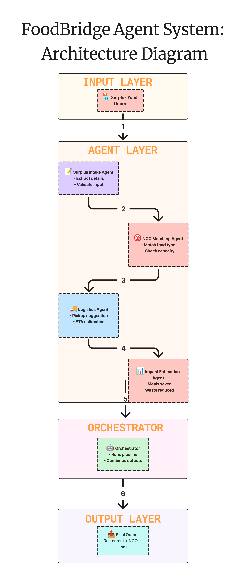
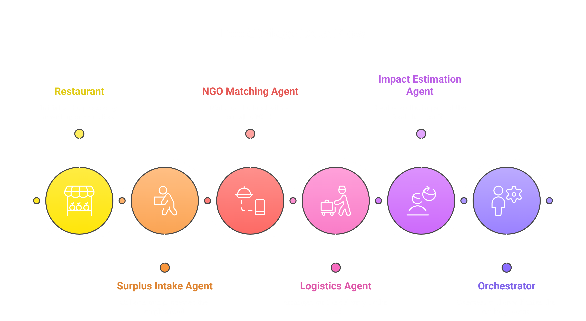

# 🌍 FoodBridge Agent System  
### An AI-Powered Surplus Food Redistribution Agent | Kaggle x Google Capstone (Agents for Good)

FoodBridge is an AI-based multi-agent system built using **Google’s Agent Development Kit (ADK)**.  
It tackles one of society’s most critical challenges:

> **Millions of meals are wasted daily while millions of people go hungry.**

FoodBridge automates:
- surplus food intake  
- NGO matching  
- basic logistics  
- impact estimation  

This repository contains the full code, diagrams, notebook, and documentation created for the **Kaggle x Google Developers: ADK Capstone – Agents for Good Track**.

---

## 🌍 Why FoodBridge Matters

  
   
  <em>Food waste is a global crisis — millions of meals are discarded every day.</em>

  
   
  <em>Meanwhile, countless families struggle daily with hunger and food insecurity.</em>

FoodBridge bridges this divide by intelligently redirecting surplus food  
to NGOs and community organizations that need it the most.

---

# 🎯 Project Objective

FoodBridge is designed to address:

### ✔ Urban Food Waste  
### ✔ Uneven Resource Distribution  
### ✔ Slow NGO Coordination  
### ✔ Lack of Technological Tools in Relief Systems  

By automating:
- 🏷 Surplus food intake & validation  
- 🎯 NGO matching  
- 🚚 Pickup & ETA suggestions  
- 📊 Impact estimation  
- 🧾 Structured reporting  

FoodBridge proves how **AI agents can solve real-world societal problems**.

---

# 🧠 System Architecture Overview

FoodBridge uses modular, interpretable agents:

### **1. Surplus Intake Agent**
Extracts & validates food type and quantity.

### **2. NGO Matching Agent**
Finds the best NGO match based on:
- food needs  
- capacity  
- quantity  

### **3. Logistics Agent**
Provides pickup suggestions & ETA.

### **4. Impact Estimation Agent**
Computes meals saved & waste reduced.

### **5. Orchestrator**
Controls the full workflow & returns structured results.

---

## 🏗 Architecture Diagram

  
   
  <em>High-level architecture of the FoodBridge Agent System.</em>

---

## 🔁 Sequence Diagram

  
   
  <em>Google-style sequence diagram representing the agent workflow.</em>

---

## 🔧 Data Flow Diagram

  
   
  <em>Data movement across agents — from donor to NGO.</em>

---

## 🧩 Swimlane Diagram

  
   
  <em>Shows which agent performs which stage of the pipeline.</em>

---

# 🔧 Technologies Used

- 🐍 Python  
- 🤖 Google Agent Development Kit (ADK)  
- 📄 JSON event formatting  
- 🔁 Rule-based + LLM-assisted logic  
- 📊 Matplotlib for evaluation  
- 🧪 Kaggle Notebook runtime  

---

# 📁 Repository Structure

FoodBridge-Agent-System/
│
├── README.md
├── LICENSE
├── requirements.txt
│
├── notebook/
│   └── foodbridge.ipynb
│
├── src/
│   ├── agents.py
│   ├── orchestrator.py
│   └── utils.py
│
└── assets/
    ├── architecture_diagram.png
    ├── sequence_diagram.png
    ├── swimlane_diagram.png
    ├── data_flow_diagram.png
    ├── fight_food_waste.jpg
    ├── hungry_children.jpg

Notes:
- The `.py` files are optional placeholders for modularization.
- The main working system is inside the Kaggle Notebook.

---

# 🧪 Agent Testing & Verification

The notebook includes a **Testing Section** that demonstrates:

### ✔ Basic Pipeline Test  
Ensures the entire agent flow runs correctly.

### ✔ Multiple Scenario Test  
Checks if different inputs produce appropriate NGO matches.

### ✔ Edge Case Test  
Tests incorrect, incomplete, or unclear inputs (no crashes).

### ✔ Performance Test  
Runs the system multiple times to evaluate stability.

### ✔ Latency Measurement  
Provides an estimate of response time per request.

Judges and contributors can run these cells directly to evaluate the system’s behavior.

---

# ⚙️ How to Run the Project

### **Option 1: Kaggle Notebook (Recommended)**  
Open the notebook → Click **Run All**  
This will execute the full agent pipeline with logs.

### **Option 2: Local Environment**
Install dependencies:
Then open the notebook in Jupyter or VS Code.

---

# 🔮 Future Enhancements

FoodBridge is designed with scalability in mind. Potential next steps:

- Real geolocation-based routing (Maps API)  
- Volunteer dispatching system  
- Live NGO availability tracking  
- Multi-agent parallel processing  
- Dedicated web/mobile interface  
- Deployment on Google Vertex AI Agent Engine  

---

# 🙌 Acknowledgements

This project was built as part of the **Kaggle x Google Developers – Agent Development Kit Capstone**.  
Special thanks to:

- Google ADK Team  
- Kaggle Community  
- Open-source contributors  
- Everyone working toward reducing food waste  

---

# 📜 License

This project is open for educational and research purposes.  
You are free to fork, improve, and extend the system.

